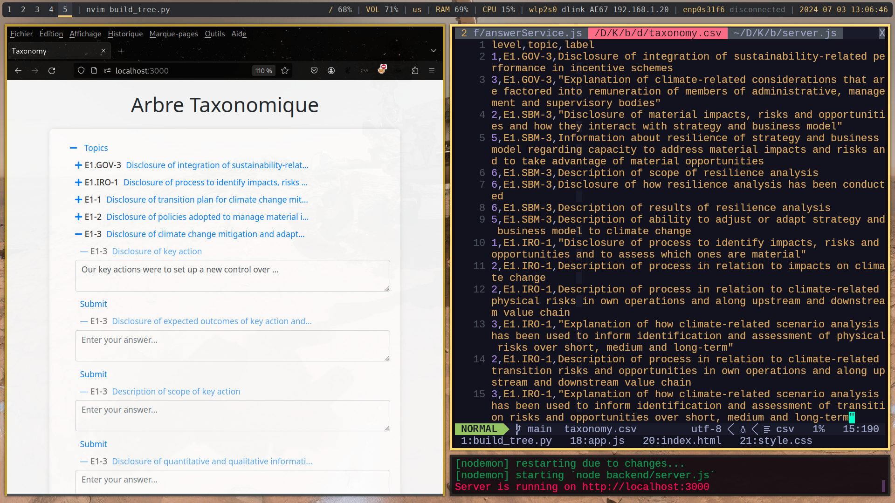

# Kiosk Case Study CSRD Reporting Tool

## Overview

This project demonstrates a basic fullstack web application that visualizes nested data in a hierarchical tree structure. It's designed to handle complex nested data sets where each node can have multiple levels of children.



## Features

- **Tree Navigation:** Navigate through a hierarchical taxonomy structure.
- **Expand/Collapse Nodes:** Click on nodes with sub-nodes to expand and collapse them.
- **Interactive Interface:** Buttons change appearance to indicate expandable nodes.
- **Answer Text Area:** Users can enter responses to different topics in a text area and submit them to the server.
- **Bootstrap Styling:** Utilizes Bootstrap for a responsive and modern UI.

## Installation

1. **Clone the repository:**

   ```bash
   git https://github.com/DevprojectEkla/KioskCaseStudy.git 
   cd KioskCaseStudy
   ```

2. **Install dependencies:**

   ```bash
   npm install
   ```

3. **Start the server:**

   ```bash
   npm start
   ```

4. **Open the application:**

   Open your web browser and go to `http://localhost:3000`.

## Usage

- Upon opening the application, users see the root nodes of the taxonomy tree.
- Click on nodes with arrows to expand or collapse sub-nodes.
- Hover over buttons to view full text labels if truncated.

## Technologies Used

- Node.js
- Express
- Bootstrap
- HTML
- CSS

## License

This project is licensed under the MIT License - see the LICENSE.md file for details.

